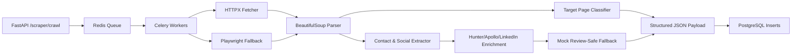

# Scraper & Enrichment Engine Strategy

## Goal

The scraper engine discovers commercially relevant B2B opportunities from institution homepages, extracts useful public contact signals, enriches missing decision-maker data, and returns normalized records ready for PostgreSQL insertion.

## Runtime Architecture

## Crawl Policy

- Start from a target homepage.
- Stay on the same root domain.
- Crawl internal HTML pages up to depth `2`.
- Prioritize pages whose URL or content indicates:
  - gift shop
  - museum store / campus store
  - wholesale
  - vendor application
  - work with us / partnerships
  - events / facility rental

## Extraction Policy

- Extract public emails using regex.
- Extract North American phone formats.
- Extract LinkedIn, Instagram, and Facebook links.
- Infer title hints from nearby page text using role keyword heuristics.
- Return low-confidence placeholders only as review-safe fallback records.

## Enrichment Policy

Production enrichment clients should be wrapped behind the same output contract currently used by `enrich_contacts_mock()`:

- Provider name
- Status
- Contact list
- Notes

Recommended provider priority:

1. Hunter.io domain search for public emails.
2. Apollo or People Data Labs for title-targeted decision makers.
3. LinkedIn company/person URL discovery through a compliant data vendor.
4. Manual review queue when confidence is low.

## Anti-Blocking Strategy

The current module includes polite pacing and realistic headers. Production workers should add:

- Per-domain rate limits.
- Redis-backed retry state.
- Premium proxy routing for only allowed targets.
- Playwright fallback for JavaScript-heavy pages.
- Snapshot storage for debugging failed parses.
- Robots.txt and terms-of-use policy checks by source category.

## Human-in-the-Loop Guardrail

Extracted and enriched contacts should feed CRM review states. They should not trigger automated outbound email. AI-generated outreach should be stored as editable drafts only.
