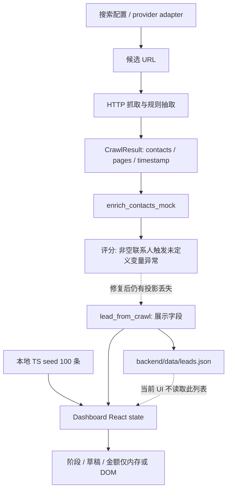

# Phase 2 — B2B Lead Discovery / Sales Intelligence 现有功能审计

审计日期：2026-09-17 至 2026-09-18（America/New_York）；五年窗口示例的 as_of 保持 2026-09-17。

基线提交：`0f2e0c22addc81573bfe4df7c9886e89bcc0db70`

分支：`codex/lead-discovery-recovery`

范围：本地代码、现有 seed/config、离线函数样例、现有回归测试、仅 localhost 的浏览器状态验证。未真实爬取、发送邮件、调用外部业务/付费 API、查询生产数据库、部署或 push。本阶段只提交本报告，不改业务代码、数据模型、数据库或 UI。

## 1. 结论与销售目标

系统的客户应定义为：拥有 IP、文化内容、品牌资产、游客/受众流量或 merchandise 需求的机构及其采购决策网络。博物馆只是一个子类。销售交付物应是“机构是谁、官网为什么可信、有什么具体机会、现在为什么联系、该找谁、公开商务联系渠道是什么、证据在哪里”，而不是高分机构名称列表。

**当前系统是可运行的候选机构展示工作台与部分发现/抽取组件，尚未形成可供销售团队持续使用的闭环。** 不宜用完成百分比掩盖关键断点：当前主抓取评分路径存在异常，联系信息在投影保存时丢失，销售工作状态不持久化，时间信号模型缺失。前端能显示 100 条机构不等于 100 条可直接询盘线索。

可保留的基础：FastAPI 路由边界、HTTPX/BeautifulSoup 抽取函数、类型定义、原 Dashboard、手工 seed、可解释评分分项的概念，以及明确的无搜索 key 兜底。需要重建的是事实证据与持久化契约，而不是重画页面。

五年内成立/开业是重要加权信号，不应成为排除成熟机构的条件。老机构的新展览、扩建、rebrand、周年或零售项目同样可能形成强机会。

## 2. 实际数据流与最紧急断点

图中虚线不表示已经实现的功能。`/scraper/crawl` 能返回完整抓取响应，但不负责数据库写入；`/api/v1/leads/crawl` 才调用评分和 JSON repository。`ready_for_insert` 是 dict 名称，不是已经执行的 PostgreSQL insert。

| 优先级 | 已确认问题 | 销售影响与证据 |
|---|---|---|
| P0 | 评分器未定义 `CONTACT_TITLE_PATTERNS` | `lead_scoring_engine.py:272` 引用但未定义/导入。离线非空 `ExtractedContact` 样例触发 NameError。真实联系人和 mock 联系人均不提供 `is_decision_maker`，因此正常主链路会到达异常分支。没有进行真实抓取来测成功率。 |
| P0 | 联系人数据在保存前消失 | `leads.py:155` 的 `lead_from_crawl` 仅保留首个有 email 联系人的职位提示；输出没有 contacts/email/phone/source_url/source_date。即使抽取多个联系人，repository 也收不到这些信息。 |
| P0 | mock 邮箱与“已验证”语义混淆 | `enrich_contacts_mock` 无联系人时制造 `partnerships+hash@domain`（0.18），不是公开发现的邮箱。普通 info 邮箱被抽取为 0.58，投影的阈值 ≥0.5 就标 Verified，并非人工核验或归属确认。 |
| P0 | 销售工作无法持久保存 | UI 阶段只 `setLeads`；没有更新 API、负责人、跟进记录。浏览器把 MoMA 改为“跟进中”，刷新后回到“未联系”。 |
| P0 | 展示数据与运行时数据分离 | 页面从静态 TS 初始化；没有 GET 运行时 leads 的加载流程。抓取后临时 prepend；刷新只剩 seed，后台 JSON 不会自动出现在 UI。 |
| P0 | CSV 导入破坏多行记录 | 导出支持带换行的 quoted 字段；导入先按物理行 split。现有合法 100 条 CSV 被实际导入解析函数解释成 1,000 条。 |
| P1 | 无 key 查询任务被错误去重 | 所有 `discovery://hash` 经 `.split('/')[0]` 变成 `discovery:`；每类 5–8 个查询只返回一个目标任务。 |
| P1 | 实体、来源与时效没有可信边界 | 官网身份不核验；地址/机构名可能占位；事件日期、职位归属、证据片段、复核时间无落库契约。 |

P0 表示 Phase 3 销售可用前必须处理，不表示本审计已经实施修复。阶段 1 的服务启动和 5 项无 key 回归通过仍然成立，但不构成“真实抓取→联系人评分→持久化成功”的证明。

## 3. 现有 100 条 seed 的真实覆盖

统计直接读取 `frontend/data/lead-discovery/seed-leads.json`，没有访问记录中的网址。字段有值也不代表本轮核验过真实性。

| 类别 | 数量 |
|---|---:|
| Museums & Cultural Institutions | 20 |
| Tourism & Attractions | 15 |
| Universities & Schools | 15 |
| Nonprofit Organizations | 15 |
| Corporate & Institutional Gifts | 15 |
| Retail & Chain Companies | 10 |
| Influencers & Events | 10 |

全部记录 country=US；不是只收录博物馆，也还不是完整北美覆盖。前端把 7 类折叠为 Museum/University/Corporate/Attraction，seed 转换没有保留 Zoo/Aquarium 细分类。后台接收 5 类手选类别，另有 5 个 discovery phase，这三套分类不是同一体系。

| 字段覆盖 | 非空记录数 |
|---|---:|
| 任意邮箱（所有现有 email 字段合并） | **0** |
| 零售或合作联系人姓名 | **0** |
| retail_contact_title | 62 |
| phone | 5 |
| contact_page_url | 60 |
| gift_shop_url / online_store_url | 52 / 62 |
| vendor_application_url / wholesale_url | 0 / 0 |
| LinkedIn | 5 |

`retail_contact_title` 中的团队/岗位描述不能算具名联系人。75 条 `manual_review`，25 条 `missing_contact`；预置 opportunity_score 为 70–97，confidence_score 为 70–96。高分和高 confidence 并未证明有可询盘负责人，前端“采购联系人”指标实际数的是 Verified 机构数而非联系人数。

UI 通过 `vendor_application_url ?? contact_page_url` 把普通 contact URL 显示成“采购页面”。三家重点博物馆的对应链接即使用这个回退；不能据此声称找到了采购申请入口。所有 wholesale 字段都为空，缺失展示应继续保持缺失。

## 4. 完整销售链路逐段审计

| 阶段 | 当前实现 | 距离销售闭环的缺口 |
|---|---|---|
| Discovery | SerpAPI/Bing 分支、配置 query、无 key 查询计划、手工 seed；DailyCrawler CLI 目标为 4 个 seed | directory_sources 只是名称清单，无目录采集 adapter；target_count 只是目标数字；无搜索分页/预算/任务游标；region 被回显但未参与 engine 查询；无实际常驻调度器。provider 当前外部可用性本轮未核验。 |
| Institution Identification | URL host 第一段拼成机构名；seed 有人工名称 | `moma.org` 变成 Moma，不能代表官方名称；共享域名、分馆、运营商与项目没有关系模型。 |
| Website Verification | Pydantic HttpUrl、HTTP 获取、跟随重定向、HTML 类型检查 | 可访问≠官网；没有官方归属、重定向域名复核、失效/停业状态。4xx HTML 仍可能被解析；`crawled_pages` 是 visited 尝试数，日志可能在无成功页面时仍写 success。 |
| Institution Classification | 用户选择/来源 phase 分类，seed subcategory | 无基于证据的分类器；Zoo/Aquarium 被后台映射为 aquarium，garden 可从 museum query 进入 Museum；DMO、visitor center、festival 等没有明确类型与角色。 |
| Founded / Opened / Reopened Date | 无字段/抽取器 | 没有日期证据、精度、事件与法律成立区分；不能计算五年窗口。 |
| IP / Merchandise Opportunity | 静态主题、产品建议；评分正则与若干预期输入字段 | 不是 IP 资产识别；不能区分可见主题、机构持有资产、可许可权利；不保存机会证据、产品需求、时机或预算。 |
| Gift Shop / Store Detection | URL/title/前 2500 字正则匹配 gift_shop 等 | 全站导航可污染匹配；一个页面只选 matches[0]。About 页仅有 Store/Procurement/Events 导航即可得 gift_shop 0.98。未区分线上店与实体店，爬虫未产出 has_online_store；异域店铺被内部链接过滤。 |
| Contact Page Discovery | BFS 普通链接遍历；seed contact_page_url | 无 contact/staff 页面类型与优先级。PDF 名录排除；站内链接遍历 set 无优先级，预算可能耗在无关页面。 |
| Staff / Decision Maker Discovery | 整页找首个职位关键词；ExtractedContact 数组 | 不提取人名/department，不把联系方式绑定到 staff card；缺少 Founder、Marketing、Brand、Licensing 等角色；公司与个人 LinkedIn 不区分。 |
| Public Business Email / Phone | 正则 email、北美 phone、social links | 无证据片段/职位归属/有效期；多个 email 共享整页第一个 phone/title/social；电话型联系人随后会被 lead 投影忽略；无 public/guessed/role/person 状态。 |
| Lead Scoring | 6 维规则权重、分项 signals/penalties、建议行动 | 非空联系人路径异常；预置分与实时规则不等价；没有时机/新机构信号；完整解释和版本没有持久保存。 |
| Deduplication | 页面 canonical URL、发现 host、Lead domain hash、contact 完整 JSON | 粒度不一致，既误合并又漏合并；没有持久实体匹配、冲突审核或 merge lineage。 |
| Sales Review | drawer、阶段按钮、可编辑文本、机会板 | 没有保存、复核人、权限、分配、任务、审计历史；草稿保存按钮没有 handler。 |
| CRM / Export | 静态 seed CSV/JSON 脚本、旧 CRM sidebar | 不导出运行时 leads；不导出多个联系人/证据；导入多行 bug；无 CRM mapping、external_id 或同步状态。旧 sidebar 未接入 active Dashboard，relative draft URL 在当前 Next 配置也无代理。 |

现有 `SCRAPER_ENGINE_ARCHITECTURE.md` 的 Redis/Celery/PostgreSQL/Hunter/Apollo 图是策略设想。源码没有实现这些队列、数据库写入或富集 provider，不应作为已上线能力引用。商城 Supabase 中的 museums/inquiries 是目录与询价业务；没有证据显示 Lead Discovery 在使用它们，不应复用商城表来凑 CRM。

## 5. 目标字段逐项映射

图例：**有**=现有结构中有相应字段，但不自动代表可信；**部分**=临时/异名/单值/投影丢失；**缺**=需要新契约。S=SeedLead，C=CrawlResult/ready_for_insert，L=持久化展示 Lead，U=前端 state/DOM。具体来源见第 12 节。

| 目标字段 | 现状 | 现有映射、真实性与建议 |
|---|---|---|
| institution_name | 有/部分 | S.name 人工 seed；L.name 从 domain 推导。应分 official_name、display_name、aliases、证据及核验状态。 |
| institution_type | 部分 | S.category/subcategory、L.category、discovery phase 不一致。统一可扩展层级/多标签，并保留原分类。 |
| website | 有 | S.website_url / L.websiteUrl / C.institution_homepage；新增官网验证状态、canonical_url、alias。 |
| domain | 部分 | C.domain，L 仅用其 hash 作 ID 未显式保存。应保存规范 host 与 registrable domain，不能只靠 domain 唯一。 |
| city | 有/占位 | S.city；L 固定 Research，不能导出成真实城市。应 nullable 并有来源。 |
| state | 有/占位 | S.state；L 固定 NA。需要地理规范化与来源。 |
| country | 部分 | S.country 默认 US；L 不保存。不能从默认值推断新候选的国家。 |
| founded_year | 缺 | 评分/seed/抓取模型无日期字段；应由 founded 事件按精度派生。 |
| opened_year | 缺 | 应为 venue opened 事件；不可与 founded/reopened 混用。 |
| new_institution | 缺 | 建议三态/派生值，基于可信事件日期与 as_of，不永久存无解释 bool。 |
| recent_expansion | 缺 | 从 expansion Signal + 窗口派生，保留扩建对象与证据。 |
| recent_rebrand | 缺 | 从 rebrand Signal 派生，保存新旧名称/品牌关系。 |
| description | 部分 | S.evidence_notes、L.theme；评分可读取 description，但抽取/落库未产出该字段。需有来源事实摘要。 |
| ip_theme | 部分 | L.theme 为 subtype+notes 或页面类型；不是有置信度的主题列表。 |
| collection_or_brand_assets | 缺/评分预留 | 评分读取 collection_focus、has_asian_collection 等任意 dict 键，不能算已采集/存储。需要命名资产、类型、来源、权利归属状态。 |
| gift_shop | 有/部分 | S.gift_shop_url、C.has_museum_store、L.giftShopUrl。未知与 false 分开，区分商店主页/导航提及。 |
| online_store | 部分 | S.online_store_url；active UI 从该 seed URL 提示 Online store detected。抓取端未可靠区分线上/实体，L 无此字段。 |
| merchandise_existing | 部分 | 商店正则是间接信号，评分预期 current_merchandise_keywords 但无产出。需商品类别和直接证据。 |
| merchandise_opportunity | 部分 | S.recommended_product_angle / L.productIdea 是静态建议，不能视作确认需求。宜落到 Opportunity。 |
| contact_name | 缺有效数据 | S.retail_contact_name/partnership_contact_name 字段存在但全空；C 无 name，L 无人名。 |
| contact_title | 部分 | S.retail_contact_title，C.title_hint，L.decisionMaker；后者可能为模板/邮箱文本。需要原文与规范角色分开。 |
| department | 缺 | 评分能读取 contacts.department，但 ExtractedContact 不定义、不抽取。 |
| business_email | 部分 | S 多个 email 槽位全空；C.email 可抽取或 mock；L 丢失。ContactChannel 需来源与公开性/核验状态。 |
| public_phone | 部分 | S.phone 5 条；C.phone 整页首个；L 丢失。应支持多号、分机、机构总机与个人商务号区分。 |
| contact_page | 部分 | S.contact_page_url；C 仅联系人 source_url 可能碰巧是 contact 页；L 未专门保存。 |
| staff_page | 缺 | 无专门页面类型/字段；只可能作为偶然 source_url。 |
| linkedin/company_social | 部分 | S LinkedIn/Instagram/TikTok/YouTube；C linkedin/instagram/facebook 数组；L 丢失。必须区分机构 profile 与个人 profile。 |
| lead_source | 部分 | S.source_type；DiscoveryTarget.source/query；这些不完整贯穿到 L。需可追溯导入/发现批次。 |
| source_url | 部分 | S.source_url；C contacts.source_url/target_pages.url；L 不存正式 source_url。需要字段级多个证据。 |
| source_date | 缺/混淆风险 | C.scraped_at/last_scraped_at 是抓取时间，非发布时间/发生时间，L 又丢失。应分别保存 published_at、observed_at、event_date。 |
| lead_score | 有但不可直接使用 | S.opportunity_score→U.score 为预置；实时评分→L.score；无版本且实时路径异常。 |
| score_reason | 部分 | ScoreBreakdown.signals/penalties 即时返回；L.notes 只有页数摘要，不存完整理由。 |
| sales_opportunity | 部分/mock | OpportunityDealBoard 金额由 score 推导为 $25k/$8k，概率为 min(90,score-5)；不可作为真实商机预测。 |
| reason_to_contact_now | 缺 | 没有事件时效、采购窗口、联系人组合；产品建议不等同联系理由。 |
| status | 部分 | S.outreach_status 与 U/L.pipelineStage 两套值；seed 映射全部 Not Contacted；UI 修改不保存。核验状态应与销售阶段分离。 |
| assigned_salesperson | 缺 | 无用户/团队/分配字段或权限。 |
| notes | 部分 | S.evidence_notes、U/L.notes 为系统/预置说明，不是带作者时间的销售日志。 |
| last_contacted | 缺 | 没有 Activity；点击 Email Sent 不是实际发送事实。 |
| next_follow_up | 缺 | 无联系人/机构/商机级任务与日期。 |

没有把动态 Python dict“可以塞任意键”计为已支持。合格支持需要定义、产出、证据、API 往返、持久化和 UI/导出读取均贯通。

## 6. 哪些是 mock、启发式或仅前端展示

- 100 条 seed 是已有预置候选，包含现实机构名称，但本轮未在线验证；它们不是实时发现的证明。
- `enrich_contacts_mock` 的兜底邮箱是合成值，必须与公开提取的联系渠道隔离；不能进入可联系导出。
- `createPreviewLead` 在请求失败时生成固定 61 分、域名推导名称、NA/Research、中心坐标；它还把任意失败笼统解释为后端未连接。500 评分错误可被 UI 的预览兜底掩盖。
- 点击 discovered URL 也可直接创建 preview，没有执行核验或抓取；无 key 时 discovery URL 则只是计划任务，不是机构。
- seed 地图为州级近似坐标，运行时使用 39/-98；不是机构定位。
- `Confidence score` 是 seed 数值，`Online store detected (existing seed data)` 来自 seed URL 的存在性；没有新增实时检测。
- CRM 阶段只是 `useState`；Opportunity 金额/概率是分数公式 + uncontrolled input；草稿内容是模板 + textarea，保存按钮没有持久化动作。
- ProcurementView 是客户向 Auctus Lab 询价的展示 form，未连接提交 handler，不是采购负责人检索/CRM 保存实现。
- 旧 EmailCompositionSidebar 的“Mark Reviewed”只改 state，“Send / Sync to Gmail”没有 handler；不是发送或同步能力。当前 Dashboard 的草稿页也不调用独立 LLM draft endpoint。

## 7. 多联系人与建议实体边界（仅设计建议）

**应拆分 Institution 与 Contact。** 现有 S 的 retail/partnership/procurement 固定槽位无法表达同一部门多人、同一人多岗位、职位变动与多个电话/邮箱。C.contacts[] 只是暂时的通道抽取结果，不是已经落库的多联系人模型。

离线 staff 页包含 Alice/Gift Shop Manager 与 Bob/Marketing Director 两个独立区块。当前抽取能得到两个 email，但为两人都绑定 Alice 的电话及 Gift Shop Manager 标题，不提取人名；这比单纯缺字段更危险，不能把 page-level 线索当 person-level 事实。

建议最小实体边界：

| 实体 | 核心内容与关系 |
|---|---|
| Institution | 稳定 ID、官方名称/别名、类型、地理、验证状态、描述；允许 parent/venue/operator 关系。一个域名可以对应多个机构/分馆，一个机构也可多个域名。 |
| Contact | 稳定 ID；person / role mailbox / institution desk 类型。无公开姓名时保留岗位/总机，不造姓名；不要用邮箱作为 person 的唯一永久 ID。 |
| ContactRole / 机构联系人关系 | institution_id + contact_id + 原始职位 + 规范角色 + department + 任职有效期 + 证据。最小阶段可以先支持一机构多联系人，同时预留跨机构履历关系。 |
| ContactChannel | 联系方式类型、原值/规范值、归属（person/department/institution）、公开商务来源、观察/核验时间、unknown/extracted/reviewed/invalid/placeholder 状态。多个公开电话/邮箱不覆盖彼此。 |
| Evidence | URL、页面标题、支持事实的短片段/定位、published_at、observed_at、内容 hash、提取方法/版本、置信度、复核人。字段引用 evidence_id，网站主页不能替代联系人证据页。 |
| Signal | institution_id、类型、事件日期与精度、状态、证据、多源关联、first_seen/last_seen、时效。记录“发生了什么”，不宣称有预算。 |
| Opportunity | institution_id、销售产品角度、相关 signals、目标 contacts、采购/授权假设、联系理由、阶段与负责人；金额/概率可空，只有实际获知/评估后才填。 |
| SalesReview / Activity | 核验决定、作者时间、销售状态、分配、实际联系记录与 follow-up。至少建立可持久化的审核与跟进契约；不要求 P0 做完整第三方 CRM。 |

Signal 与 Opportunity 应分开：一个 reopening 同时支持 visitor merchandise、retail program 等多个机会；一个 merch 机会也可能由 expansion+anniversary 两个事件支持。没有成熟商机之前仍应能保存真实信号。

角色词表需覆盖 Founder/Owner、Executive Director、Marketing、Brand、Licensing、Retail/Merchandise、Gift Shop Manager、Partnerships、Procurement、Visitor Experience；大学增加 bookstore buyer、auxiliary services 等。**词表命中只提供候选岗位，不证明本人有预算或决策权。** 公共 company LinkedIn 不应绑定成首个联系人个人 LinkedIn。

迁移建议：先定义模型与 API contract，在隔离的 Lead Discovery 数据域建立增量存储，保留旧 seed ID→稳定 ID 的映射和只读导入快照；旧 U 由 adapter 读取新模型。不要覆盖商城 museums/inquiries，不大规模重写 UI，也不要在本阶段执行 migration。

## 8. Sales Signals：如何支持“现在值得联系”

当前仅有 TargetPage 类型、即时评分字符串和自由文本 notes；没有独立事件、日期、证据、去重、生命周期。因此**还不适合可靠保存以下时效信号**。可以扩展现有 Python 服务，但不能只往 notes 追加字符串或增加若干 bool。

| 公开信号 | 建议证据与日期语义 | 销售用途 / 误判边界 |
|---|---|---|
| Founded within 5 years | 机构官方 About/历史明确成立日期；founded 与法人注册分开 | 新机构产品体系可能未完善；不拿域名/版权年份当成立年份。 |
| Newly opened | 官方已开业/开馆公告，实际 opening 日期 | 首批纪念品/IP 产品；计划开业与已开业分开。 |
| Grand opening | 官方启幕活动日期、venue 关联 | 活动/首发商品；与同一 opening 关联去重，不叠加两次高分。 |
| Reopening | 官方恢复开放日期与关闭背景 | 更新商品/visitor experience；不当作新机构成立。 |
| Expansion | 官方工程/新增展区公告，计划和完成日期 | 新主题产品、零售空间；区分可研、动工和已完成。 |
| New exhibition | 官方展览标题、开闭幕日期、合作方 | 展览周边与授权；保存期限及许可待确认，不默认馆藏归属即商业授权。 |
| Anniversary | 可核验的周年公告或基础日期+纪念年份 | 纪念款；每年度事件独立，避免每次重抓变“新信号”。 |
| Rebranding | 官方品牌更新、新旧名称/视觉资产及发布日期 | 新周边/IP 产品；不只凭页面换色或标题修改判定。 |
| New gift shop | 官方新店/改造/店铺运营公告 | 新零售商品机会；确认机构自营还是外包运营。 |
| New visitor center | 官方项目/开幕公告、地点、运营方 | 游客纪念品；关联到地点与采购主体。 |
| New campus | 大学官方校区开幕/发展公告 | 校园纪念品、校友商品；新楼宇不等于新大学。 |
| New attraction | 官方设施/体验上线日期、名称 | 主题 merchandise；运营商与项目区分。 |
| New IP / mascot | 官方角色/吉祥物发布及权利主体 | 联名、角色商品；可见 IP 不代表可以获得许可。 |
| New retail program | 官方 merch/licensing/store program 公告 | 新供应商/产品项目；供应商售卖 wholesale 不等于买方愿采购。 |
| New tourism project | DMO/运营方官方项目启动、里程碑 | 地标/IP/目的地商品；项目名与采购法人分开。 |
| New funding / grant | 官方获批公告、金额、用途与时间 | 可能存在项目资金；不能将受限 grant 自动当 merchandise 预算。 |
| Increased visitor traffic | 可比较的同口径两期官方数据、统计期间 | 零售规模机会；禁止用缺少基期的“增长”营销文案计算增幅。 |

还应覆盖 gallery/cultural institution、park/zoo/aquarium/garden/historic site、visitor center、旅游公司/DMO、大学 bookstore、festival/event 等来源分组。它们不必全部独立 discovery phase，但分类与来源策略应明确。query 中默认 museum/shop 会漏掉尚未开店的新场馆；既有 Corporate/Retail 类可以保留，但应按文化/IP fit 排序，不能仅因为是大公司而占优。

建议 Signal 字段：`id, institution_id, type, title, subject/asset_id, event_date_start/end, date_precision, announced_at, source_published_at, observed_at, first_seen_at, last_seen_at, evidence_ids, confidence, review_status, event_status(planned/confirmed/completed/cancelled), expires_at, supersedes_signal_id`。Unknown 不能当 false；冲突日期并存待审核；事件内容更新追加 revision，不覆盖原证据。

五年窗口以审核的 as_of 为准：本报告基准日 2026-09-17，对明确“已发生”事件可计算 2021-09-17 至 2026-09-17 的滚动五年范围。只有年份而无月日的边界记录应标“可能在窗口内/精度不足”，不能编造 1 月 1 日。未来计划事件不计作已成立/已开业，但可独立成为筹备期机会。营销时效窗口应按 signal 类型区别设置，五年是机构生命周期特征，不等于五年前的公告今天仍需立即联系。

`reason_to_contact_now` 应由已审核信号+日期+产品角度+目标岗位组成，并带来源。示例模板（非实际机构事实）：因某馆计划于某日开放新展区，建议联系公开列出的 Retail Buyer 讨论与该主题相关的首批商品。信息缺失时保留“需人工研究”，不补猜日期/姓名/邮箱。

## 9. Lead Score 是否适合销售团队

当前权重：museum_fit 15%、gift_shop 20%、wholesale_potential 15%、cultural_heritage_fit 20%、corporate_tourism_fit 15%、partnership_probability 15%。它偏向既有商店、亚洲/中国馆藏和大型访客/员工规模；这些可能适合部分产品，但不等于广义 IP 开发销售潜力。

主要缺陷：

1. 先修复非空联系人 NameError，否则讨论权重调优没有意义。
2. seed 人工分与实时分没有相同输入、校准或版本，不应共用高分阈值宣称可成交。
3. 评分读取访客量、员工量、馆藏旗标等字段，但 crawler 未提供；未知默认零会惩罚资料稀少的新机构。
4. mock contact 可移除“无联系方式” blocker，generic 检测也不认 `partnerships+hash`。当前会先遇到 NameError；修复异常后，若不同时清除 mock 数据，还会出现虚假可联系加分。这是潜在评分缺陷，不是本轮测到的成功加分结果。
5. 官网 merchant 向公众售卖/批发不证明它是我方买家；任何 events/partnership 词也不证明采购窗口。
6. 缺少时机、证据置信度、岗位匹配、渠道可用性、最近复核、联系过/重复/不合适等维度；blocker 只是乘数，甚至 disqualified 可继续有分数，不构成资格门禁。
7. `_text_blob` 接收的抓取文本实际由 target page 标题拼接，正文没有进入完整事实模型。实时 online store 单独信号也未贯通。
8. 机会板概率/金额来自分数，未用任何实际成交数据校准，不能视为销售预测。

建议先分开显示：**机构适配度 Fit、近期时机 Timing、可联系程度 Contactability、证据可信度 Evidence、数据完整度 Coverage**。总排序可后续配置，但不能掩盖任一维度为 unknown；没有审过的有效公开渠道不能进入“可询盘”队列。没有信号的老机构仍可作为 evergreen fit 候选，不被五年条件剔除。

保存 `score_version, scored_at, component_scores, evidence_ids, missing_fields, exclusions, human_override/reason`；用跨机构类型的人工审核样本校准排序，而不是以 seed 的高分自证准确。P0 验收先要求“事实+联系人+来源能往返保存”，P1 再做时效评分，P2 才用经确认的销售反馈评估排序。

## 10. 数千至数万机构、去重与导出

### 10.1 容量与运行方式

现状不适合团队持续维护数千至数万机构。结论来自结构审计，**没有做吞吐/容量压测，不能给出可信 QPS 或最大条数**。

- repository 每次全量读 JSON、查找后全量覆盖，O(N)；没有事务、文件锁、原子替换、增量查询，多个请求可能丢更新。
- 单域 hash upsert 会以新抓取记录覆盖旧 pipelineStage=Not Contacted 等字段，没有区分来源事实与销售手工字段。
- UI bundle 带所有静态 seed，过滤/排序/卡片在客户端完成，无 API 分页/索引/虚拟列表；GET leads 也无分页。
- 抓取在请求内串行；batch/daily 串行等待，无持久 queue、重试、幂等任务、断点恢复、dead-letter 或失败分类。固定 sleep 不是跨 worker/domain 的限流。
- 搜索没有 cursor/page，提前到 max_results 可能在 dedup 前结束；原型的 target_count 数字不是规模能力。
- 没有多销售用户鉴权、权限隔离、分配锁与活动审计。API 接收任意 HttpUrl、跟随跳转，未来开放给团队前需做内网/回环地址及重定向目标限制、请求预算与批量上限；当前本地恢复不构成上线安全证明。

建议先以独立 Lead 数据域的事务存储、稳定 ID/唯一约束、分页查询实现可靠手工审核小闭环；再加入幂等 job、checkpoint、按域限流、来源预算及重试，不要求 P0 同时上复杂微服务。

### 10.2 Deduplication

| 当前层 | 实际行为 | 主要风险 |
|---|---|---|
| canonicalize_url | 去 query/fragment、裁末尾 `/` | 离线 `venue?id=1` 与 `venue?id=2` 都变成同一路径；会误合并 query 代表实体的页面。 |
| discovery target | 先丢路径，仅 scheme+netloc；host 去重 | 同域学校/分馆/政府项目提前坍缩；http/https、www 处理与其他层不完全一致。无 key discovery scheme bug 已复现。 |
| root_domain | 去 www 的 host，并非公共后缀识别 | store 子域、学校子站可能被视为另一机构；不同域名属于同一机构则漏合并。 |
| Lead ID | SHA1(domain) 前 12 位 | 机构等同域名；没有 domain alias、分支/运营者、改名合并和人工复核；seed-index ID 与实时 ID 不相同。 |
| contact | 整个 model JSON 相等才去重 | 同邮箱不同来源被重复保存；不同人共享总机/部门邮箱不该自动合并成一人；当前也没有稳定 Contact ID。 |
| UI | 新结果 prepend，无 ID upsert | 重复请求可追加相同 ID；seed 与实时同机构可并存。 |

建议分层：保留原 URL 和规范候选；HTTP 去重键与 institution identity 分离；机构用名称/官网证据/地址/组织关系匹配并人工确认不确定项；联系方式先规范化、归属类型明确，再合并证据；Signal 以机构+事件类型+对象+事件时间+来源别名聚合。所有合并保留 provenance 和可撤销记录，不在每次重抓时生成全新销售线索。

### 10.3 CSV / CRM

现有 CSV 可读，但脚本只导出旧 `frontend/data/seed-leads.ts`，不是 active 模块或后台持久数据；`--import` 写 imported-leads.json，UI 不消费。原字段能作为 legacy import mapping，不能作为最终 CRM 契约。

建议：

- 最小导出 `institutions.csv` + `contacts.csv`（institution_id 外键），再提供 `signals/opportunities.csv`；如果 CRM 需要平面表，显式选择“每机构一行”或“每联系人一行”，不要隐式丢掉第二联系人。
- 稳定 external_id、字段 schema_version、枚举映射、ISO 日期、UTF-8、空值语义；包含可验证来源与审核状态、负责人、follow-up。
- 使用支持 quoted multiline 的 CSV parser；保留换行/引号，验证类型、重复 ID、非法字段与必需来源。导入先 dry-run，不能直接覆盖销售手工字段。
- 默认只导出公开、经审核的业务联系渠道；placeholder、冲突、已作废记录隔离；表格导出需处理以 `= + - @` 等开头的公式单元格，避免把原始网页字符串当公式。
- CRM 连接将来要有幂等 upsert、远端 ID、失败重试与同步审计，但 P0 可以先提供可靠手动 CSV；本阶段没有选择/调用任何 CRM 服务。

## 11. 离线验证结果与边界

证据脚本/JSON 存于忽略目录 `_backups/lead-discovery-phase2-audit/`，不进入提交；测试只有合成 `example.org` 字符串，不访问其网址。Python probes 对 HTTPX transport 设置拒绝调用，浏览器只允许 localhost:3000 的 GET。没有调用真实 crawl endpoint、写入真实客户状态或产生抓取数据。

| 检查 | 方法/结果 |
|---|---|
| 原 5 项 runtime 测试 | 在 backend 执行 `.venv/Scripts/python.exe -B -m unittest discover -s tests -v`，5/5 通过；覆盖服务/no-key，不覆盖成功抓取评分。 |
| seed 完整性与可联系覆盖 | 100 条；所有邮箱和具名联系人为 0；电话 5；统计见第 3 节。 |
| 多人同页 | 两个邮件对应到相同首个 phone/title，错误归属复现。 |
| Verified 标签 | 仅 info@example.org 的抽取置信度 0.58，直接投影标 Verified。 |
| 联系数据投影 | 手构完整 CrawlResult，输出 19 个展示键，无 contacts/email/phone/evidence/time；不调用爬虫。 |
| 非空联系人评分 | 实际运行 score，捕获未定义 CONTACT_TITLE_PATTERNS 的 NameError，确认为现有产品缺陷，未修复。 |
| mock contact 风险 | 无公开联系人时生成 0.18 合成邮箱；generic 检查为 false；contact-path blocker 被移除。 |
| 页面分类 | 仅导航词的 About fixture 被判 gift_shop 0.98；普通 Contact fixture 无 target type。 |
| 发现计划去重 | 原查询 8/6/6/6/5，返回目标数均为 1。 |
| URL 身份 | 两个 query venue 合并；发现 adapter 丢掉共享 host 的机构路径；外部店域不视为 internal。 |
| CSV 往返 | 标准 csv reader 读取 100 条；仅执行既有 TS parser 纯函数得到 1,000 条，未执行脚本的导入/导出写入分支。 |
| CRM 刷新 | Playwright 在独立浏览器 context 把 MoMA 标为“跟进中”，刷新恢复“未联系”；无 POST、无外部请求、无页面异常。 |

测试执行时曾从项目根目录运行 backend unittest，因 cwd 不正确出现 `No module named app`；按已有文档从 backend 重跑通过。这是执行位置问题，不计为产品缺陷。上述 NameError 则是不同问题，已由实际评分函数离线复现。

未测试：网站在线真实性、外部 provider 当前服务状态、邮箱投递/SMTP、真人决策权、生产 DB、真实销售转化、规模吞吐。本报告不把离线可执行等同于上述验证成功。

提交前完整性检查：39 个指定字段均有独立映射行；报告中的源码相对链接存在；全部既有 tracked 文件的 SHA256 与本阶段审计前相同。本阶段新增的唯一拟提交文件为本报告，证据脚本留在忽略目录，商城原有改动不进入提交。

## 12. 主要代码证据索引

下列行号以审计基线为准，可按函数名定位。策略文档与实际实现已区分。

- [SeedLead 字段与默认值](../frontend/data/lead-discovery/seed-leads.ts#L12)、[seed→Dashboard 投影](../frontend/data/lead-discovery/seed-leads.ts#L551)。
- [active Dashboard state / 更新 / fetch](../frontend/components/lead-discovery/DashboardView.tsx#L372)、[采购展示表单](../frontend/components/lead-discovery/DashboardView.tsx#L884)、[机会金额/概率](../frontend/components/lead-discovery/DashboardView.tsx#L980)、[详情与草稿按钮](../frontend/components/lead-discovery/DashboardView.tsx#L1296)、[preview](../frontend/components/lead-discovery/DashboardView.tsx#L1414)。
- [发现引擎与去重](../backend/app/services/discovery_engine.py#L41)、[配置](../backend/app/data/discovery_sources.json)、[daily CLI 逻辑](../backend/app/services/daily_crawler.py#L11)。
- [联系人 schema](../backend/app/services/scraper_engine.py#L66)、[页面分类](../backend/app/services/scraper_engine.py#L159)、[联系人抽取](../backend/app/services/scraper_engine.py#L202)、[mock 富集](../backend/app/services/scraper_engine.py#L281)、[抓取响应组装](../backend/app/services/scraper_engine.py#L307)。
- [评分规则与联系人异常](../backend/app/services/lead_scoring_engine.py#L261)、[blocker](../backend/app/services/lead_scoring_engine.py#L296)、[字段期望](../backend/app/services/lead_scoring_engine.py#L374)。
- [API 抓取/保存](../backend/app/api/leads.py#L84)、[lead_from_crawl](../backend/app/api/leads.py#L155)、[JSON repository](../backend/app/services/lead_repository.py#L8)。
- [seed CSV 导出/导入](../frontend/scripts/discover-leads.ts#L1)、[旧 sidebar](../frontend/components/email-composition-sidebar.tsx#L73)、[后端 draft endpoint](../backend/app/api/crm_email_drafts.py#L88)。
- [商城数据库结构](../supabase/schema.sql)、[策略而非已实现架构](../backend/app/services/SCRAPER_ENGINE_ARCHITECTURE.md)。

## 13. Phase 3 路线：P0 / P1 / P2

以下是建议执行顺序和验收门槛，不是本轮已授权开发、爬取、第三方接入或部署计划。

### P0 — 真实、可验证、可询盘的机构 + 联系人

1. **消除伪事实与阻断错误。** 修复联系人评分 NameError；移除合成邮箱进入正式联系数据的路径；未知保留 unknown；禁止把普通 info/置信度阈值标成人工 Verified；明确 preview 与已核验记录。验收：无联系人不生成邮箱；有/无/多联系人评分均不崩溃，来源和缺失不被掩盖。
2. **确立 Institution—Contact—Evidence 最小契约。** 统一分类覆盖上述机构范围；保存官网归属、稳定机构 ID、多个具名或岗位联系人、公开渠道、岗位/部门与来源；role mailbox 允许存在但明确不是具名负责人。验收：两人两电话的 staff fixture 不串位，联系人及证据经 API→持久化→UI→导出往返不丢失。
3. **修复身份核验与联系页优先发现。** 支持 contact/staff/team/about 页面及可靠公开手工录入；官网、运营商、共享域分馆与店铺外域人工审核；没有证据不自动认定采购入口。验收：同域两分馆不被误合并，同机构别名候选可审核；来源 URL+片段+observed_at 可追溯。真实联网验证须在后续明确授权范围内开展，本阶段不执行。
4. **接通持久化 Sales Review。** 独立 Lead 数据域，UI 加载/更新同一 repository；保存审核状态、负责人、notes、last_contacted、next_follow_up；抓取事实更新不覆盖人工销售状态。验收：刷新/重启后仍在，重复写入幂等，不能误把点按钮当发送事实；最小团队访问边界明确。
5. **可靠去重与 CSV 最小交付。** 修复 multiline round-trip；机构与联系人分表/外键导出，只有经审核真实渠道进入可询盘视图；不使用 seed index/domain hash 作为唯一实体判据。验收：100 条 fixture 往返还是 100 条、unicode/引号/换行保真、两联系人无损导出、placeholder 被排除。
6. **销售试用门槛。** 由销售选跨类别小样本（museum、tourism/attraction、zoo/garden、大学/bookstore、festival/DMO 至少有代表），逐条审核“机构+官网证据+相关岗位/公共商务渠道+联系理由”。必须能够区分可直接询盘、只有总机/表单、尚待研究，不能靠补造信息追求满字段。批量发现放大应在这些链路通过后。

P0 可先保存手工 Signal/Opportunity 的最小证据契约与 reason_to_contact_now；自动事件识别不应阻塞联系人真实性与保存修复。不要求立即建完整 CRM 或改变旧 UI 风格。

### P1 — 时效信号与持续发现

1. 建立独立 Signal/Opportunity 生命周期，支持 founded/opened/reopened/expansion/rebrand 等全部第 8 节事件，日期精度/证据冲突/计划与实际状态明确；五年窗口可解释、不硬过滤。
2. 优先官方新闻、项目公告、机构 About/时间线及手工来源输入，按机构类型扩充查询；修复 discovery:// 去重、region 与分页契约，目录名称升级为可审计来源 adapter（外部调用另行授权）。
3. Fit/Timing/Contactability/Evidence 分维排序，保存 score_version 与理由；跨类别人工标注评估误报，不用原 seed 分充当 ground truth。
4. 加入机构改名/分馆/运营商/多域名关系、ContactRole 更新、离职/过期线索复核；Signal 重抓幂等，取消项目可撤回联系理由。
5. 引入最小持久任务队列、按域限流、重试/断点、来源预算、服务端分页和审计日志。验收：失败可重试不重复创建，新信息不会丢弃人工 CRM 状态。

### P2 — 团队规模化与 CRM 集成

1. 在隔离测试数据上进行 1k/10k/更大规模的查询、并发更新、队列恢复和导出压测，设定实测 SLA；再决定索引、批量接口和 UI 虚拟列表。
2. 接入经用户指定的 CRM：字段映射、external_id、幂等同步、冲突/失败重试、同步审计；保留 CSV 作为可审核出口。接入与外发权限单独授权。
3. 多销售负责人、任务/提醒、细粒度访问、活动历史、去重/merge 可撤销、转化反馈与评分质量看板。
4. 在真实审核数据足够后，评估更复杂 IP/岗位/事件抽取；LLM/付费富集不是事实来源替代品，结果仍须有公开证据与人工复核。自动发邮件不包含在这一路线的默认授权中。
